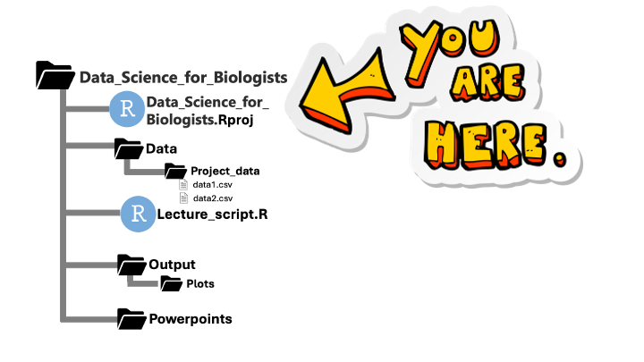

```{r setup, include=FALSE}
knitr::opts_chunk$set(echo = TRUE, eval=FALSE)
library(tidyverse) 
```

## Setup

To do these exercises, you will need to the `tidyverse` library. Lets go ahead and start with the script you have created in your R project. You will want to *save* this script for future reference, and start with this code to begin:

```loadlibs
library(tidyverse) # packages used for data manipulation 
library(introverse) # if you want :)
```

<br>

---


<br>

## LETS GET STARTED!
### Handling dataframes
The so you know the `msleep` dataset is pre-loaded from the `tidyverse` package. So it's a pre-loaded dataset called `msleep`. Just type `msleep` in your console... Give it ago! This data set  provides different physical and behavioral characteristics of mammals, including how much they sleep. Below is information about the data or what we call 'metadata'  


**Dataset source & description:**  
- **Reference:** Savage, V. M. & West, G. B. (2007). "A quantitative, theoretical framework for understanding mammalian sleep." *Proceedings of the National Academy of Sciences*, 104(3), 1051–1056.
- **Usage:** `msleep`  
- **Format:** A data frame with 83 rows and 11 variables:  
  - `name`: Common name  
  - `genus`:genus of animal
  - `vore`: Carnivore, omnivore, or herbivore?  
  - `order`: order of animal
  - `conservation`: Conservation status of the animal  
  - `sleep_total`: Total amount of sleep (hours)  
  - `sleep_rem`: REM sleep (hours)  
  - `sleep_cycle`: Length of sleep cycle (hours)  
  - `awake`: Amount of time spent awake (hours)  
  - `brainwt`: Brain weight (kg)  
  - `bodywt`: Body weight (kg)  
  
  
Back to dataframes... Technically, columns in data frames are actually *named arrays*. We can access them directly using the dollar sign `$`. A dollar sign followed by a column name (without quotes) returns that column as a vector. The code below extracts the `name` column from the `msleep` data frame. Run and understand it, and then modify it to extract the `awake` column instead.
```msleep_q1
msleep$name
``` 

<div class = "prompt">Use the dollar-sign `$` to extract the `name` column from the `msleep` data frame, then extract the `awake` column. Print both to confirm your result.</div>

```{r msleep_dollar-example}
# extract and print the name column
msleep$name

# extract and print the awake column
msleep$awake
```

<div class = "prompt">Now figure out how to count how many missing values (`NA`) are in the `sleep_rem` column, then display the rows that contain these `NA`s.</div>
+ Hint: Use function `is.na()` to create a logical vector of NAs, wrap it in `sum()` to count missing values, and use that same logical vector inside `msleep[...]` to subset rows.

```{r msleep_na-example}
# count missing values in sleep_rem
sum(is.na(msleep$sleep_rem))

# show rows with missing sleep_rem values
msleep[is.na(msleep$sleep_rem), ]
```

---

<br>

## Exploring the dataset
Okay take some time to familiarise yourself with the msleep dataset before you proceed to work with it, using functions like `head()`, `names()`, `str()`, `view()` etc. In particular, there is a great `dplyr` function `glimpse()` which can reveal a lot of helpful information about a data frame. It's similar to the `str()` function, but the output is much nicer to look at. Run it to see! Be sure you `#` the code you are working with!

```explore-msleep
glimpse(msleep)
head(msleep)
```


<br>

---

<br>


## dplyr Set 1: Working with `dplyr` verbs

<br><br>

### Subsetting rows with `filter()`

<div class = "prompt"> Use `filter()` to subset `msleep` to only herbivores.</div>

+ Hint: The `vore` column will tell you if a mammal is an herbivore. You want find all rows where `vore == "herbi"`. 
+ Think: Why not `vore == herbi`? ... `"herbi"` is a STRING, not a variable!


``` {r, dplyr_filter1-solution}
msleep %>%
  filter(vore == "herbi")
```

<div class = "prompt"> Use `filter()` to subset `msleep` to only animals who are *awake* for at least 12 hours of the day.</div>

+ Hint: "At least" like saying "greater than or equal to," i.e. `>=`

 

``` {r, dplyr_filter2-solution}
msleep %>%
  filter(awake >= 12)
```

<div class = "prompt"> Use `filter()` to subset `msleep` to only *herbivores* who are *awake* for at least 12 hours of the days.</div>

+ Hint: `dplyr` makes it easy to supply "and" conditions to `filter()` simply with commas: `filter(statement1, statement2)`. This is "the same" as writing: `filter(statement1 & statement2)`.

  


```{r dplyr_filter3-solution}
msleep %>%
  filter(vore == "herbi", awake >= 12)
```  

<div class = "prompt"> The code below uses `filter()` to subset `msleep` to include only *herbivores and insectivores*, using the `%in%` logical operator to help craft the statement. Engage with and understand the code, and modify it to subset the data to keep only *herbivores and carnivores*. </div>

+ Hint: You can do this in multiple ways. Try it out! Either...
+ Use the logical `%in%` operator as in: `filter(column %in% c(thing_i_want, other_thing_i_want))`. In this case you want the `vore` to be something in this array: `c("herbi", "insecti")`
+ OR, use the pipe `|` symbol to ask if `vore` equal "herbi" or if `vore` equals "insecti"


```dplyr_filter4
msleep %>%
  filter(vore %in% c("herbi", "insecti"))
```   

```{r dplyr_filter4-solution}
msleep %>%
  filter(vore %in% c("herbi", "carni"))

# OR:

msleep %>%
  filter(vore == "herbi" | vore ==  "carni")
```   

<div class = "prompt"> Use `filter()` to subset the data to only carnivores who weigh more than 50 kg. </div>

+ Hint: mammals that are carnivores _and_ that weigh more than 50 kgg


```{r dplyr_filter6-solution}
msleep %>%
  filter(vore == "carni", bodywt > 50)
```   

### Subsetting columns with `select()`


<div class = "prompt">  Use `select()` to keep only the columns `name`, `awake`, `sleep_total`, `sleep_rem`, and `sleep_cycle`. </div>

+ Hint: Simply list the columns (without quotes!) in select. No need to use `c()`.


``` {r dplyr_select1-solution}
msleep %>%
  select(name, awake, sleep_total, sleep_rem, sleep_cycle)
```

<div class = "prompt"> Use `select()` to *remove* the columns `genus` and `order`. </div>

+ Hint: To remove a column, preface it with the minus sign.


``` {r dplyr_select2-solution}
msleep %>%
  select(-genus, -order)
```

### Counting the number of rows

Often we need to know "how many rows are in this wrangled data frame?" There are broadly two ways to do this:

+ Use the `nrow()` function which you already know! Because `nrow()` takes a data frame as its argument, we can pipe `dplyr` pipelines into it! But it returns a NUMBER, NOT another data frame, so we can't pipe *out* of it into another `dplyr` function.

```demo-nrow
nrow(msleep)

# or..
msleep %>%
  nrow()
```


+ Use the `dplyr` function `tally()` which gives you a _tibble_ of the row count. *We will learn more interesting uses of this function later, but for now, you should know that it will count your rows and return a tibble:*


```demo-tally
msleep %>%
  tally()
```


<div class = "prompt">Answer the question: How many mammals weigh more than 2000 kg?</div>

+ To answer this, we'd use `filter()` to get only the rows of interest (mammals which weigh more than 2000)
+ The number of rows remaining represents the answer to the question. (add `tally()` to the pipeline)
+ **HOWEVER**, rather than just looking at our own eyes and determining ourselves how many rows are there, we want to use **code** to figure that out for us. **This is a central concept in coding: We are using computers, so let's ask the computer to do it for us! Eyeballs are not reproducible.**


```{r tally_q1-solution}
msleep %>%
  filter(bodywt > 2000) %>%
  tally()
```


<br><br>

### Creating new columns with `mutate()`
What does mutate do? `mutate()` adds new or modifies existing columns in a data frame by computing values based on existing variables or constants. It returns the full data frame with those new or updated columns, making it easy to build up a sequence of transformations in a single `%>%` pipeline.
<div class = "prompt"> The code below uses `mutate()` to create a new column called `bodywt_g` which contains the body weight but in grams instead of kg, as is recorded in the existing `bodywt` column. Engage with this code, and then modify it to instead create a new variable called `bodywt_lbs` which contains the body weight in pounds (1 kg = 2.2 lbs).</div>

+ Hint: This question shows you that you can directly refer to and use existing columns when creating new ones.
+ Hint 2: Can you add `select()` to the end of your pipeline to make sure your code worked as intended?

```dplyr_mutate2
msleep %>%
  mutate(bodywt_g = bodywt * 1000) # multiply kg by 1000 to get grams
``` 

```{r dplyr_mutate2-solution}
msleep %>%
  mutate(bodywt_lbs = bodywt * 2.2) # multiply kg by 2.2 to get pounds

# To check your answer, I recommend:
msleep %>%
  mutate(bodywt_lbs = bodywt * 2.2) %>%
  # selecting both of these columns will help you confirm that bodywt_lbs=2.2*bodywt
  select(bodywt_lbs, bodywt)
``` 

<div class = "prompt"> Use `mutate()` to create a new column called `percent_day_awake` that gives the percentage of the day that each species spends awake, and use `select()` at the end to make sure your calculations worked. </div>

+ Hint: There are 24 hours in a day, and the column `awake` says how many hours a day (on average) that species is awake. So, `(awake / 24) * 100` is the percent awake!


```{r dplyr_mutate3-solution}
msleep %>%
  mutate(percent_day_awake = (awake / 24) * 100) %>%
  # Select the column we created to ensure it worked
  select(percent_day_awake)
``` 

<br><br>

### Organizing data frames with `rename()` and `arrange()`

<div class = "prompt">Use `rename()` to change the name of the column `conservation` to `conservation_status`.</div>

+ Hint: `rename()` syntax is: `rename(newname = oldname)`. You do NOT need to use quotes.
+ Hint 2: Spielman gets the arguments backwards all the time, and you probably will too! Just remember if there are bugs, it's `NEWname = OLDname`.


```{r dplyr_misc1-solution}
msleep %>%
  rename(conservation_status = conservation)
``` 

<div class = "prompt">Use `arrange()` to sort the dataset in *ascending* order of `bodywt`.</div>

+ Hint: `arrange()` sorts in ascending order by default


```{r dplyr_misc2-solution}
msleep %>%
  arrange(bodywt)
``` 

<div class = "prompt">Use `arrange()` to sort the dataset in *descending* order of `bodywt`.</div>
 
+ Hint: Use `desc()` to sort by descending order of a column instead of just writing the column name, like: `arrange( desc(COLUMN) )`.


```{r dplyr_misc3-solution}
msleep %>%
  arrange(desc(bodywt))
``` 

<div class = "prompt">Use `rename()` to change the name of the column `vore` to `food_preference`.</div>

```{r dplyr_misc4-solution}
msleep %>%
  rename(food_preference = vore)
``` 

### Removing duplicate rows
In many circumstances, we are interested in subsetting data to only keep _unique_ rows and therefore remove duplicates. We simply use the `dplyr` function `distinct()` for this - no arguments! Below shows you how to use the function, but it's not very interesting yet since there are no duplicate rows in `msleep`! 


```demo-distinct
msleep %>%
  distinct()
```


<div class = "prompt">Modify the pipeline below to only keep distinct rows at the end. First, engage with to understand which duplicate rows you expect will be removed. Finally, you also remove all combinations in the result with `NA`?</div>


```demo-distinct2
msleep %>%
  select(vore, conservation)
```

```{r demo-distinct2-solution}
msleep %>%
  select(vore, conservation) %>%
  distinct() %>%
  drop_na()
```

<br>

---

<br>


## dplyr Set 2: Practice putting the `dplyr` verbs together

> Remember: You can always use functions like `select()` to _check_ your code, even if `select()` is not actually part of the solution.

<div class = "prompt"> Use `filter()` to subset `msleep` to only primate species (order is "Primates") whose conservation status is least concern ("lc") (two things to filter!!), and then use `rename()` to change the column `vore` to be called `diet`.</div>

+ Hint: There are two things to filter on here! Remember to use a comma within `filter()` to specify them both.


```{r dplyr_pipe4-solution}
msleep %>%
  filter(order == "Primates", conservation == "lc") %>%
  rename(diet = vore)
``` 

<div class = "prompt"> Subset the data to contain only carnivores with body weights greater than 50 kg. Then, arrange the data in ascending order of body weight. Finally, keep only columns `name`, `bodywt`, `brainwt` in that order. </div>

+ For an added challenge, _simultaneously rename_ the column `name` to `common_name`. You can do this in `select()` using `rename()` syntax.

```{r dplyr_pipe5-solution}
msleep %>%
  filter(vore == "carni", bodywt > 50) %>%
  arrange(bodywt) %>%
  select(name, bodywt, brainwt)

# Added challenge
msleep %>%
  filter(vore == "carni", bodywt > 50) %>%
  arrange(bodywt) %>%
  select(common_name = name, bodywt, brainwt)
``` 

<div class = "prompt"> Engage with the templated code below, whose goal is to show just the `bodywt` and `name` columns for all mammals whose brain weight is less than 2. Alas, the code has a bug! Can you figure out *WHY* the code has a bug and fix the code? </div>

+ Hint: What lessons did you just learn in the previous question? Apply them here!

```dplyr_pipe7
msleep %>%
  select(bodywt, name) %>%
  filter(brainwt < 2) 
``` 

```{r dplyr_pipe7-solution}
# Need to reverse the order! The original "logic" was flawed
msleep %>%
  filter(brainwt < 2) %>%
  select(bodywt, name) 
``` 

<div class = "prompt"> Now, let's finally see why `distinct()` is a helpful function. We want to answer this question using a `dplyr` framework: What are the unique vores in the dataset? To address this question, we need to first subset the data to only contain the `vore` column, and then use `distinct()`:</div>

+ Engage with the code below, and understand _why I had to write it in this order._ Think about why it would NOT work to first get all unique rows and then select only `vore`. 

```distinct-vore-demo
msleep %>%
  select(vore) %>%
  distinct()
```


<div class = "prompt"> Subset `msleep` to arrive at a tibble that contains just the column `vore` and shows only the unique vores that mammals of the order `"Carnivora"` belong to. In other words, what do carnivores eat? (The answer should make some sense...)</div>

+ Hint: You first want to filter to the rows of interest (carnivores!!), and then figure out how to get the distinct vores for that group.


```{r dplyr_pipe10-solution}
msleep %>%
  filter(order == "Carnivora") %>%
  select(vore) %>%
  distinct()
```

<br>

---

<br>


## dplyr Set 3: Summarizing data with `dplyr`


<div class = "prompt"> Use `summarise()` to create a summarised dataframe with a column `mean_awake` that contains the mean number of hours spent awake.</div>


```{r dplyr_summarise1-solution}
msleep %>%
  summarise(mean_awake = mean(awake))
``` 

<div class = "prompt"> Perform the same exact task as the last question, except this time use `mutate()` rather than `summarise()`. The goal of this question is so you can see clearly how mutate and summarise differ. </div>


```{r dplyr_summarise2-solution}
msleep %>%
  # Now we have a whole column where all rows have the same value.
  mutate(mean_awake = mean(awake))
``` 


<div class = "prompt"> Use `summarise()` and `mean()` to determine the average amount of time spent in REM sleep (column `sleep_rem`)  by all mammals in the dataset `msleep`. </div>

+ Make sure to give your new column an informative name!
+ There are `NA`'s in this column, so you need to tell the function `mean()` to ignore NA's with the extra argument `na.rm = TRUE`. Remember that?! It's an argument to **`mean()`**, NOT to `summarise()`!!
  

```{r dplyr_summarise4-solution}
msleep %>%
  summarise(mean_rem = mean(sleep_rem, na.rm=TRUE))
``` 


<div class = "prompt"> Use `group_by()` calculate the median (with `summarise()` and `median()`!) body weight (`bodywt`) of each `vore` group.</div>

+ Make sure to give your new column an informative name!
+ First, you set up the grouping with `group_by(COLUMN-TO-GROUP-BY)` (in this case, `vore`), and then pipe into `summarise()`


```{r dplyr_summarise5-solution}
msleep %>%
  group_by(vore) %>%
  summarise(med_bodywt = median(bodywt))
``` 


<div class = "prompt">Use `group_by()` calculate the mean body weight (`bodywt`) of each *combination* of `vore` and `conservation` groups. </div>

+ You can specify multiple groupings to `group_by()` just by listing the columns. 
+ Added challenge: can you add a pipeline step that will remove _all rows_ containing `NA`?


```{r dplyr_summarise7-solution}
msleep %>%
  group_by(vore, conservation) %>%
  summarise(mean_bodywt = mean(bodywt)) %>%
  drop_na()
``` 

<br>

---

<br>


## EXTRA Questions... Are you a pro?
<div class = "prompt">Now, using the previously defined `banana_price`, use `rep()` to create a vector `prices` that repeats the banana price 5 times. Then **divide** each element of `prices` by 2 and print the result.</div>

+ Hint: Use `rep(banana_price, times = 5)` to build your vector, and remember that dividing a numeric vector by a scalar applies the operation element-wise.


```{r variables_q6-solution}
banana_price <- 0.55

# repeat the banana_price 5 times
prices <- rep(banana_price, times = 5)

# divide each by 2 and print
prices / 2
```

<div class = "prompt">  Use all your skills to wrangle the data to arrive at the answer to this question: Which group has the highest average body weight: herbivores or insectivores? </div>

```{r, dplyr_summarise10-solution}
# There are MANY WAYS to arrive at this solution! Below is one good option:
msleep %>%
  filter(vore %in% c("herbi", "insecti")) %>%
  group_by(vore) %>%
  summarise(mean_bodywt = mean(bodywt)) %>%
  arrange(desc(mean_bodywt)) # answer: herbivores!
```

<div class = "prompt"> Use all your skills to wrangle the data to arrive at the answer to this question: Which group has the highest **average ratio** of body weight to brain weight: domesticated or non-domesticated mammals? *Make sure to PLAN your steps before coding them. When coding, go LINE by LINE.*</div>

+ Hint: `if_else()` will be useful here!
+ Hint 2: These columns contain plenty of `NA`s. How do I know? I LOOKED AT THE DATA!


```{r, dplyr_challenge-solution}
msleep %>%
  # I personally find it much easier to see what's going on by only keeping these 3 columns
  select(conservation, bodywt, brainwt) %>%
  # remove rows where at least one of our variables of interest is NA. How do I know to do this? I ran code without first this line, and results had tons of NA! So, maybe I should have removed them
  drop_na(conservation, bodywt, brainwt) %>%  
  mutate(cons_type = if_else(conservation == "domesticated", "dom", "notdom")) %>%
  group_by(cons_type) %>%
  mutate(ratio = bodywt/brainwt) %>%
  summarise(mean_ratio = mean(ratio)) # answer: domesticated
```


<br>

---

<br>


## Your project data
Now that you're getting the hang of things lets start playing around with your project data. But first.... How do I find my data? Well thats the beauty of the structure of a R project. You minimize the working directory nonsense. That many people struggle with when they start R. It also makes it way easier to share with collaborators!

So real quick see where you're working by typing 
```
getwd() 
```
if you created your project on your desktop you should be in the folder 'Data_Science_for_Biologists'. Now be sure that you have your data in your 'data' folder. 


Each dataset should be saved as a .csv file. To read these in we need to use the right function and point R in the right direction. This should be simple try running this code: 
```
# read in data example
data <- read.csv('Data/xxxxxx')
```
**SHORT CUT** a cool trick is after you put in your `read.csv()` function with the '' in the (). Try pressing tab... This will bring up all of the folder options and will allow you to scroll through your project find things quickly!


## Have a look at your data! 
Now using the functions we just went through, have a look at your data! No need to worry about 'messing' things up! Try inspecting your data using the dplyr functions!


