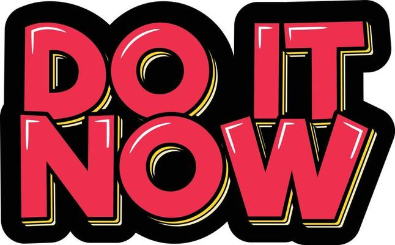
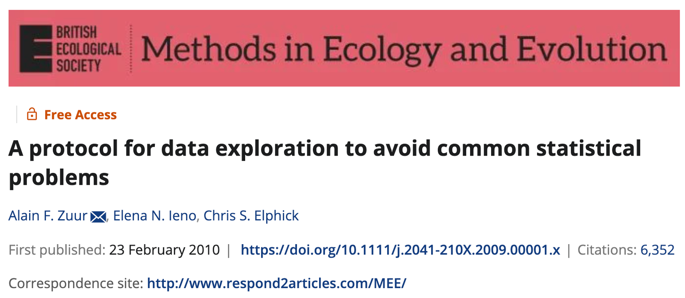
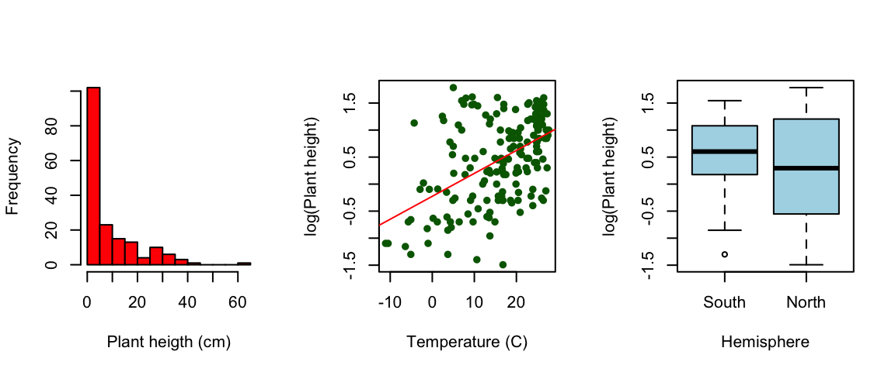

```{r setup, include=FALSE}
knitr::opts_chunk$set(echo = TRUE, eval=FALSE)
library(tidyverse)
```

## Setup

For this weeks workshop we will be exploring your project data!!! Make sure you are in your respective groups (bandicoot group, plant group, genetics group... have I missed anyone?). Today we will use the same `dplyr` verbs from workshop 1 to begin cleaning up your data. We I'll give you 40 mins to do this. After the 40 mins is up each group will come up to the class to walk through an example of a problem with their data and their solution (\~20 min). [Write at least one problem with your data that you do not have a solution for (we can discuss how to troubleshoot with the class).]{.underline} The idea here is to get comfortable speaking the R 'language' and also to see how there are different ways to solve the same problem in R!


<br>

------------------------------------------------------------------------

<br>

## Step 1: Get organised

First before we get into your project data create a new R project and within your project have a folder (maybe call it data?) for your `.csv` files, and script called 'workshop_2_data_cleaning_and_exploration_day1.R'.Now what I want you to do is look over the .pdf for your project description and look over your questions. Discuss with your group how you think the data should be set up to answer your questions.

<br>

------------------------------------------------------------------------

<br>

## Step 2: Reading in your data

You should already be working inside your R Project for this workshop. This means R will treat your project folder as the starting point for any file paths, so you only need to tell it where your .csv file is stored within that folder. If your data are saved inside a data folder in your project, your file path will begin with `data/`. <br> [[*PRO TIP*]{.underline}]{.smallcaps} : Remember you can put in the `read.csv()` function as soon as you type in your "" press `tab` and you can quickly navigate folders.

```         
# Read in a .csv file from the "data" folder
my_data <- read.csv("data/example_dataset.csv")

# View the first few rows
head(my_data)
```

If your `.csv` file contains extra rows at the top --- for example, notes or metadata that are not part of the data table --- you can skip them when reading the file by using the skip argument:

```         
# Skip the first 2 rows in the file
my_data <- read.csv("data/example_dataset.csv", skip = 2)
head(my_data)
```

<br>

------------------------------------------------------------------------

<br>

## Step 3: Checking out your data frames.

Now many of you will have two different `.csv` files. Next week we will go over aspects of joining and merging data frames. For now read in each of your `.csv`s and start inspecting them individually. Here, what you want to get a handle on is how the data are set up --- making sure that columns storing numbers are actually numeric, IDs or names are character, and dates are in the correct date format. You can start exploring this by using functions like `View()` to open your data in a spreadsheet-style view, `head()` to preview the first few rows, and `str()` to see the structure and types of each column. `glimpse()` from dplyr gives a similar overview in a more compact format, and `summary()` will provide quick statistics for each column.

If you find a column that is stored as the wrong type (e.g., numbers stored as character), try fixing it with functions like `as.numeric()` for numbers, `as.character()` for text, `or as.Date()` for dates. For example, if a column named height is stored as text, you can run:

```         
# changing height column to numeric
data$height_character <- as.numeric(data$height)
```

<center>**Be sure you comment your code!**</center>



Note there will be some problems where I have not taught you the solutions... yet. Next week I will show you a few more helpful functions. For now just clean as much as you can and maybe practice filtering out the 'problem' data

<br>

------------------------------------------------------------------------

<br>

## Step 4: Start practicing your cleaning protocol!

 We want to use the steps outlined in class from Zuur et al. (2010), A protocol for data exploration to avoid common statistical problems. As you are cleaning make sure you are renaming objects as you go. For example:

```         
# Example data
data <- tibble(
  name  = c("Alice", "Bob", "Carol", "Dave"),
  score = c(85, 92, 88, 76)
)

# Filter rows where score > 85 and save as data_filter
data_filter_85 <- data %>%
  filter(score > 85)

head(data_filter_85)
```

The things you should be thinking about are: 1. Outlier detection (and/or NA detection)

2.  Homogeneity of variance

3.  Normality of the data

4.  Zero inflation or excessive zeros

5.  Relationships between Y and X variables

Here I want you to think of the functions we went over in lectures 2 & 3. So early `dplyr` functions: `filter()`, `select()`, `summarise()`, `group_by()`, `mutate()`. If you are not sure what once to use try googling 'dplyr cheatsheet'. Be sure you practice using your %\>%'s  You will also want to use a series of base R plots that will help you visualise how your data looks: `boxplot()`, `hist()`, `qqnorm()`, `table()`, `barplot()`, `plot()`, `pairs()` 
