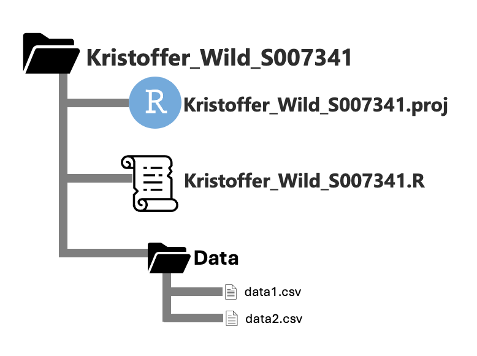

```{r setup, include=FALSE}
knitr::opts_chunk$set(echo = TRUE, eval=FALSE)
library(tidyverse) 
```

## Setup

``` loadlibs
library(dplyr)
```

<br>

------------------------------------------------------------------------

<br>

## QUIZ 2

### Question 1 (xxpts)

For this quiz you are going to save first need to unzip the `Quiz_2_folder`. To get full points for this question you will need to do the following:

1.  Rename the folder as 'STUDENT_FIRST_LAST_NAME_STUDENT#'.

2.  Create a new project in this folder. The project name should also be 'STUDENT_FIRST_LAST_NAME_STUDENT#'.

3.  Create a new r script in this same folder. The project name should also be 'STUDENT_FIRST_LAST_NAME_STUDENT#'.

For example, my file structure would look like: 

Easy points right?!

### Question 2 (xxpts).  

Now you see that we have some data in the 'data' folder. What I want you to do is use a function to read in two data sets (xxpts). Each data set should be named as the object: `data_1` & `data_2`.

### Question 3 (xxpts).  

Now you see that we have some data in the 'data' folder. What I want you to do is use a function to read in two data sets (xxpts). Each data set should be named as the object: `data_1` & `data_2`.
